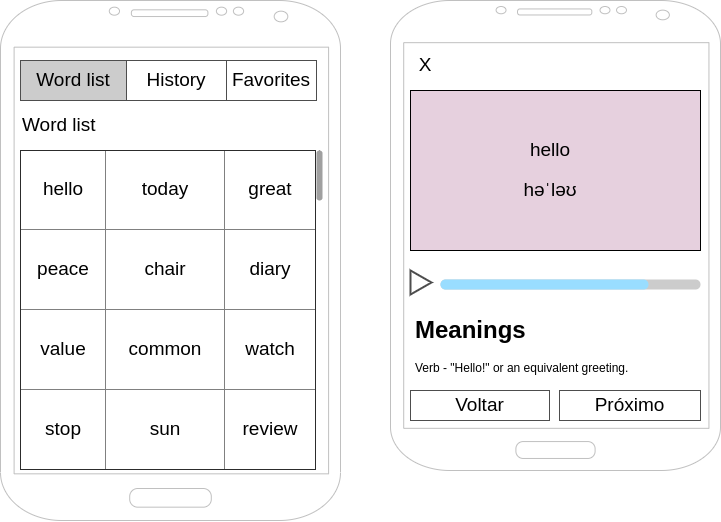

# Mobile Challenge 20240202

## Introdução

Este é um teste para que possamos ver as suas habilidades como Mobile Developer.

Nesse desafio você deverá desenvolver um aplicativo para listar palavras em inglês, utilizando como base a API [Free Dictionary API](https://dictionaryapi.dev/). O projeto a ser desenvolvido por você tem como objetivo exibir termos em inglês e gerenciar as palavras visualizadas, conforme indicado nos casos de uso que estão logo abaixo.

[SPOILER] As instruções de entrega e apresentação do challenge estão no final deste Readme (=

### Antes de começar
 
- Considere como deadline da avaliação a partir do início do teste. Caso tenha sido convidado a realizar o teste e não seja possível concluir dentro deste período, avise a pessoa que o convidou para receber instruções sobre o que fazer.
- Documentar todo o processo de investigação para o desenvolvimento da atividade (README.md no seu repositório); os resultados destas tarefas são tão importantes do que o seu processo de pensamento e decisões à medida que as completa, por isso tente documentar e apresentar os seus hipóteses e decisões na medida do possível.

### Instruções iniciais obrigatórias

- Utilize as seguintes tecnologias:

#### Tecnologias (Mobile):
- Nativo ou Hibrido (Flutter, Ionic, React Native, etc)
- Estilização (Material, Semantic, etc). Ou escrever o seu próprio sob medida 👌
- Gestão de dados (Redux, Context API, IndexedDB, SQLite, etc)

Atente-se, ao desenvolver a aplicação mobile, para conceitos de usabilidade e adeque a interface com elementos visuais para os usuários do seu sistema.

#### Tecnologias (Back-End):
- Firebase, Supabase, etc

#### Organização:
- Aplicação de padrões Clean Code
- Validação de chamadas assíncronas para evitar travamentos

### Modelo de Dados:

Conforme indicado na documentação da API, a API retorna as informações de uma palavra, tais como etimologia, sinônimos, exemplos de uso, etc. Utilize os campos indicados na documentação dos endpoints para obter os dados necessários.
 
### Front-End:

Nessa etapa você deverá desenvolver uma aplicação móvel nativa ou hibrida para consumir a API do desafio.

**Obrigatório 1** - Você deverá atender aos seguintes casos de uso:

- Como usuário, devo ser capaz de visualizar uma lista de palavras com rolagem infinita
- Como usuário, devo ser capaz de visualizar uma palavra, significados e a fonética
- Como usuário, devo ser capaz de salvar a palavra como favorito
- Como usuário, devo ser capaz de remover a palavra como favorito
- Como usuário, devo ser capaz de visitar uma lista com as palavras que já vi anteriormente

A API não possui endpoint com a lista de palavras. Essa lista pode ser carregada em memória ou ser salva em banco de dados local ou remoto (por exemplo, com Firebase). Será necessário usar o [arquivo existente dentro do projeto no Github](https://github.com/dwyl/english-words/blob/master/words_dictionary.json).

**Obrigatório 2** - Salvar em cache o resultado das requisições, para agilizar a resposta em caso de buscas com parâmetros repetidos.

**Obrigatório 3** - Seguir o wireframe para a página de listagem dos dados. Pode-se alterar a posição dos itens, mantendo as funcionalidades solicitadas.

**Diferencial 1** - Implementar um tocador de audio utilizando, por exemplo, https://responsivevoice.org/api ou recursos nativos;

**Diferencial 2** - Utilizar alguma ferramenta de Injeção de Dependência;

**Diferencial 3** - Escrever Unit Tests ou E2E Test. Escolher a melhor abordagem e biblioteca;

**Diferencial 4** - Implementar login com usuário e senha e associar os favoritos e histórico ao ID do usuário, salvando essa informação em banco de dados local ou remoto
## Readme do Repositório

- Deve conter o título do projeto
- Uma descrição sobre o projeto em frase
- Deve conter uma lista com linguagem, framework e/ou tecnologias usadas
- Como instalar e usar o projeto (instruções)
- Não esqueça o [.gitignore](https://www.toptal.com/developers/gitignore)
- Se está usando github pessoal, referencie que é um challenge by coodesh:  

>  This is a challenge by [Coodesh](https://coodesh.com/)

## Finalização e Instruções para a Apresentação

1. Adicione o link do repositório com a sua solução no teste
2. Adicione o link da apresentação do seu projeto no README.md.
3. Verifique se o Readme está bom e faça o commit final em seu repositório;
4. Envie e aguarde as instruções para seguir. Sucesso e boa sorte. =)

## Suporte

Use a [nossa comunidade](https://discord.gg/rdXbEvjsWu) para tirar dúvidas sobre o processo ou envie uma mensagem diretamente a um especialista no chat da plataforma. 
